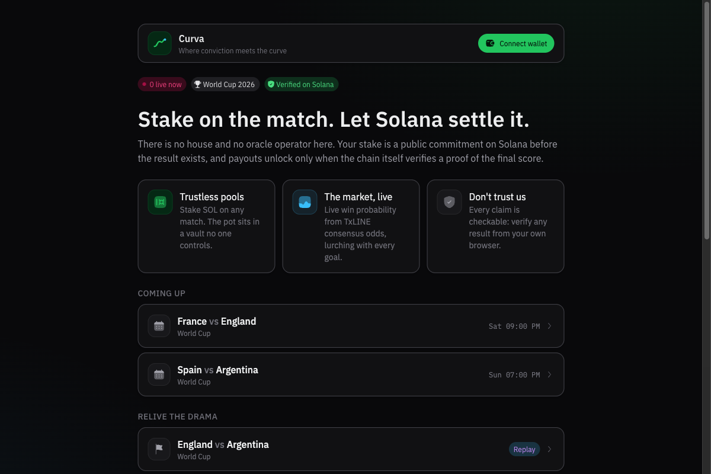
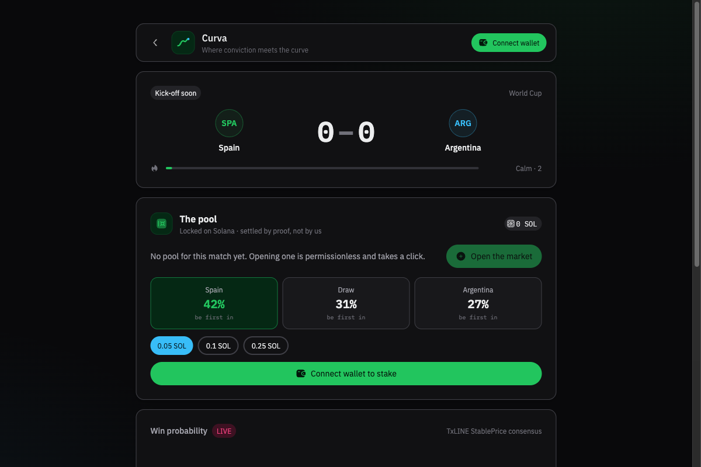
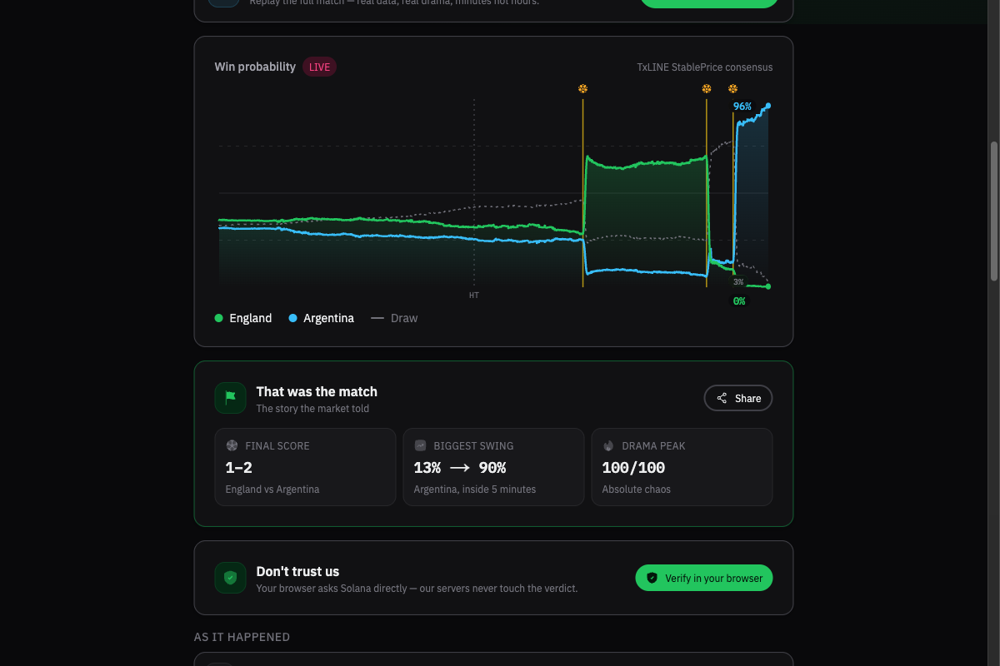
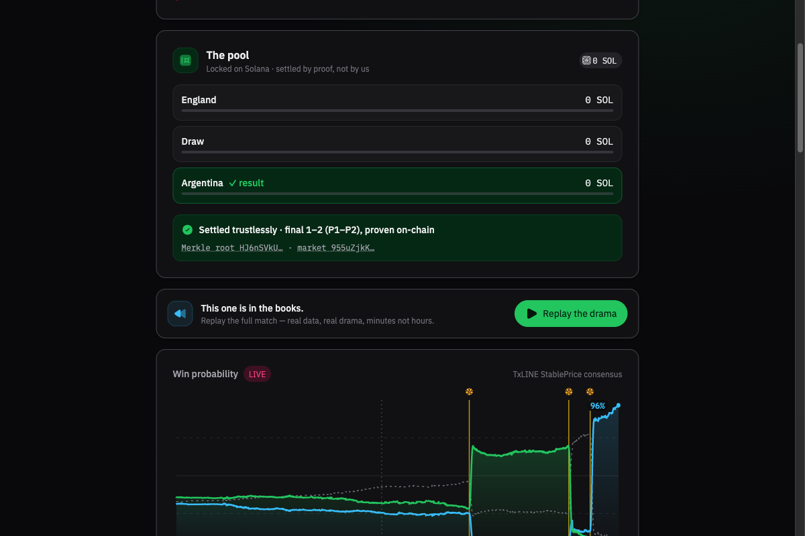

# Kryva

Parimutuel World Cup prediction pools on Solana, settled trustlessly by cryptographic proof.

> Product brand: **Kryva**. Repo folder, Vercel host (`getkryva.vercel.app`), and on-chain program crate remain `curva` for the hackathon deploy.

Fans stake SOL on Home / Draw / Away for any of the 104 World Cup matches. Stakes escrow in a
program-owned vault, the live win-probability curve streams from TxLINE's consensus odds, and when
a match finalises, **the pot settles itself**: the settlement instruction hands a Merkle proof of
the final score to TxODDS's on-chain oracle program, and funds move only if the chain verifies it.
There is no house, no oracle operator, and no admin key — every claim on the dashboard links to a
transaction or can be re-verified from your own browser.

Built for the TxODDS **Prediction Markets and Settlement** track (World Cup hackathon, Superteam Earn).

**Live app:** https://getkryva.vercel.app · **Program (devnet):** `3L9Yb4AicTqnVCAV12R1enNW5dPZHHT26QtWNiQNP4xp`

## How It Works

1. **Open a market**: anyone can open the pool for a fixture — one click, permissionless, one
   market per fixture (PDA-seeded, deterministic parameters).
2. **Stake**: pick Home / Draw / Away and stake SOL through your wallet. Lamports escrow in a
   vault PDA no one controls. Staking closes at kickoff — every position is a public
   pre-commitment on the ledger before the result exists.
3. **Watch**: the match screen streams live win probability from TxLINE's StablePrice consensus,
   a drama meter, and an event ticker. Pool-implied multipliers sit next to the professional
   market's numbers.
4. **Settle**: after the final whistle, anyone presses *Settle on Solana*. The app fetches the
   finalisation Merkle proof from TxLINE and the program CPIs into TxOracle `validate_stat`.
   The chain checks the proof against the daily scores root TxODDS anchors on-chain; a valid
   proof locks the outcome, an invalid or non-final proof always fails.
5. **Claim**: winners split the whole pot pro-rata. Unsettleable markets (abandoned matches)
   unlock automatic refunds after 72 hours.

## Settlement Integrity

```
outcome predicate:  (P1 goals − P2 goals)  {>, =, <}  0     — judged by TxOracle on-chain
```

Three gates in `settle` make wrong settlement impossible rather than unlikely:

| Gate | Mechanism |
|------|-----------|
| Finalisation-only | Proven stats must carry `period = 100`, stamped by TxLINE only on `game_finalised` records — a half-time snapshot can never settle a match that later flipped |
| Post-match window | The proof's own `max_timestamp` (hashed into the Merkle commitment, unforgeable) must be ≥ 105 minutes after kickoff |
| Fixed stat identities | Stat keys must be exactly P1/P2 total goals, so the subtraction has one deterministic meaning |

Full walkthrough: [docs/TECHNICAL.md](docs/TECHNICAL.md)

## Tech Stack

| Layer | Technology |
|-------|------------|
| Program | Anchor 0.32 (Rust), Solana devnet, CPI into TxOracle `validate_stat` |
| Frontend | Next.js 16, React 19, HeroUI v2, Tailwind v4 |
| Server | Next.js route handlers (SSE relay, proof shaping, chain reads) |
| Data | TxLINE (fixtures, StablePrice odds SSE, scores SSE, historical, stat-validation proofs) |
| Wallet | Phantom (`signAndSendTransaction`) |

## Screenshots

### Lobby


### Market — the World Cup final


### The wave — a real semifinal's market story


### Trustless resolution receipt


## Quick Start

Prerequisites: Node 18+, pnpm, Solana CLI + Anchor 0.32 (program only), a little devnet SOL.

```bash
pnpm install

# one-time: devnet wallet -> on-chain TxLINE subscribe (free World Cup tier) -> API token
pnpm tsx scripts/txline-setup.ts

# program (already deployed; rebuild/redeploy only if you change it)
cd program && anchor build && anchor deploy && cd ..

# end-to-end settlement rehearsal against a real finished fixture
pnpm tsx scripts/settlement-e2e.ts

pnpm dev
```

`scripts/txline-setup.ts` writes `.env.local` with the TxLINE API token; credentials stay
server-side — the browser never talks to TxLINE directly.

## Key Features

- **Trustless parimutuel pools**: vault PDA escrow, pro-rata payouts, automatic refunds for
  abandoned matches. No admin can move funds or decide outcomes.
- **Proof-based settlement**: permissionless `settle` that CPIs into TxODDS's oracle program —
  proven live on devnet against the real England vs Argentina semifinal
  ([settle tx](https://explorer.solana.com/tx/4VwkVQmmB1McxjUivcpp6icEGPicAoo8oZWBYkYEmfNfqGKmM9aKq9uw2FRSieLPV2T6dwDwWTDG8zMQrNWU8trN?cluster=devnet)).
- **The wave**: live win-probability curve from TxLINE StablePrice consensus, lurching with
  goals, reds and VAR in real time; drama meter and event ticker beside it.
- **Verifiable resolution UI**: every settled market shows the proven score, the Merkle-root
  account and the settle transaction, linked to the explorer.
- **"Don't trust us" verification**: one click re-runs the proof check from *your own browser*
  against devnet — our servers never touch the verdict.
- **Replay engine**: any finished match re-streams through the identical pipeline at 30–120x
  from TxLINE historical data, so the product stays fully reviewable after the tournament.
- **Live catch-up**: joining mid-match replays the full history first — the wave always shows
  the whole story.

## API

| Route | Purpose |
|-------|---------|
| `GET /api/matches` | All World Cup fixtures (live / upcoming / finished) |
| `GET /api/live/[fixtureId]` | SSE: catch-up + live relay of normalized match events |
| `GET /api/replay/[fixtureId]?speed=60` | SSE: historical re-stream through the same engine |
| `GET /api/market/[fixtureId]?owner=` | Market account + caller's positions (server-side chain read) |
| `GET /api/settle-proof/[fixtureId]` | Finalisation Merkle proof shaped as `settle` instruction args |
| `GET /api/verify/[fixtureId]` | Server-side read-only `validate_stat` check |

Program instructions: `create_market`, `stake`, `settle`, `claim` — see
[program/programs/curva/src/lib.rs](program/programs/curva/src/lib.rs).

## Project Structure

```
curva/
├── program/                    # Anchor workspace
│   ├── programs/curva/         # Settlement program (4 instructions, 3 integrity gates)
│   └── idls/txoracle.json      # TxOracle IDL for declare_program! CPI bindings
├── src/
│   ├── app/                    # Next.js pages + API routes (live, replay, market, proofs)
│   ├── components/             # Match screen, market card, wave, ticker, verify card
│   └── lib/
│       ├── engine/             # Odds→probability, drama meter, event mapper, reducer
│       ├── markets/            # Program client, browser-side proof verification
│       └── txline/             # Auth, REST+SSE client, feed normalization
├── scripts/
│   ├── txline-setup.ts         # Wallet -> on-chain subscribe -> API token
│   ├── open-market.ts          # Open a market (+ optional stakes) for a fixture
│   └── settlement-e2e.ts       # Full settlement rehearsal on a real fixture
└── docs/                       # Technical doc, API feedback, demo plan, screenshots
```

## Documentation

| Document | Description |
|----------|-------------|
| [Technical Overview](docs/TECHNICAL.md) | Architecture, settlement design, on-chain receipts, TxLINE endpoints used |
| [TxLINE Feedback](docs/FEEDBACK.md) | Honest builder feedback: what we loved, where we hit friction |
| [Demo Plan](docs/DEMO.md) | Demo video shot list and submission checklist |

## World Cup Track Submission (copy-paste)

Ready answers for the Superteam Earn **World Cup / TxODDS** form. Social / X fields omitted on purpose — fill those yourself.

| Form field | Value |
|---|---|
| **Link to Your Submission** | https://getkryva.vercel.app |
| **Project Title** | Kryva |
| **Briefly explain your Project** | *(paste block below)* |
| **Link to your live & working MVP** | https://getkryva.vercel.app |
| **Link to Your Live Demo Video** | `TODO` — add public Loom/YouTube after recording ([shot list](docs/DEMO.md)) |
| **Project's Public Repository** | https://github.com/fozagtx/curva |
| **Link to Technical Documentation** | https://github.com/fozagtx/curva/blob/main/docs/TECHNICAL.md |
| **TxLINE API experience** | *(paste from [docs/FEEDBACK.md](docs/FEEDBACK.md) — short version below)* |
| **Anything Else?** | *(paste extras below)* |

### Briefly explain your Project

```
Kryva is a parimutuel World Cup 1X2 prediction market on Solana where settlement is a cryptographic proof, not a house call.

Fans stake SOL on Home / Draw / Away. Stakes escrow in a program-owned vault. Live win probability streams from TxLINE StablePrice consensus. When a match finalises, anyone can settle: the program CPIs into TxODDS’s on-chain TxOracle validate_stat with a TxLINE finalisation Merkle proof. Funds unlock only if the chain verifies the proof — no oracle operator, no admin key.

Built for the TxODDS Prediction Markets and Settlement track. Proven on devnet against a real World Cup semifinal (England vs Argentina).
```

### TxLINE API experience (paste into form)

```
Liked most:
- Pct on TXLineStablePriceDemargined (1X2_PARTICIPANT_RESULT) — clean implied probs, no de-vig math.
- Finalisation design (game_finalised / period=100) — unforgeable on-chain gate against early-proof attacks.
- validate_stat as a CPI target — one instruction, returned bool; our settle path is ~40 lines around it.
- llms.txt + docs repo + free World Cup tier with on-chain subscribe — permissionless onboarding.

Friction:
- OpenAPI scores schema doesn’t match production (camelCase vs PascalCase; phase in StatusId).
- /api/scores/historical/{id} returns SSE-formatted text while other endpoints feel like JSON.
- Stat-validation V2 shape (statsToProve / statProofs / eventStatRoot) undocumented vs single-stat examples.
- GameState stays "scheduled" during live play; real phase is StatusId.
- Unconfirmed goal events often lack team attribution in Data — we infer from score deltas.
- Devnet SOL faucet often dry — only real onboarding wall.

Full write-up: docs/FEEDBACK.md in the repo.
```

### Anything Else?

```
Live app: https://getkryva.vercel.app
Repo: https://github.com/fozagtx/curva
Tech doc: https://github.com/fozagtx/curva/blob/main/docs/TECHNICAL.md
Program (devnet): 3L9Yb4AicTqnVCAV12R1enNW5dPZHHT26QtWNiQNP4xp
England vs Argentina settle tx: https://explorer.solana.com/tx/4VwkVQmmB1McxjUivcpp6icEGPicAoo8oZWBYkYEmfNfqGKmM9aKq9uw2FRSieLPV2T6dwDwWTDG8zMQrNWU8trN?cluster=devnet
Settled market account: https://explorer.solana.com/address/955uZjkKK4EqnmUFfVtHgWDqr85Wa1GouvMD9cQmgqV1?cluster=devnet
```

## License

MIT
